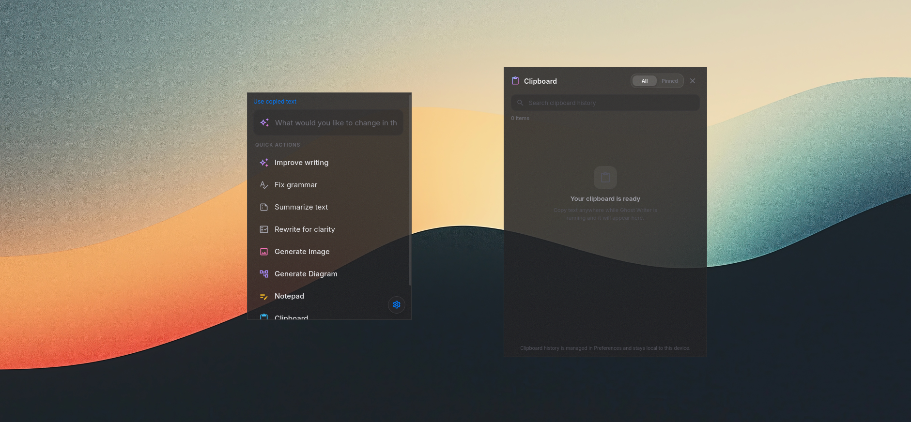

<div align="center">
  <br/>
  
  
  
  
  <br/><br/>
  
  <h1 align="center" style="font-size: 3rem; font-weight: 800; background: linear-gradient(135deg, #7dd3fc, #c084fc, #f472b6); -webkit-background-clip: text; background-clip: text; -webkit-text-fill-color: transparent;">
    👻 Ghost Writer
  </h1>

  <p align="center" style="font-size: 1.2rem; color: #a1a1aa;">
    An Apple-style, high-performance AI writing assistant for your desktop
  </p>

  <p align="center">
    <b>Built with</b> &nbsp;
    <a href="https://v2.tauri.app/"></a>&nbsp;
    <a href="https://www.rust-lang.org/"></a>&nbsp;
    <a href="https://tailwindcss.com/"></a>&nbsp;
    <a href="https://developer.mozilla.org/en-US/docs/Web/JavaScript"></a>
  </p>

  <br/>
</div>

---




---

## ✨ Features

<table>
  <tr>
    <td width="50%">
      <h3>📋 System-Wide Capture</h3>
      <p>Press <code>Ctrl+Shift+U</code> (or <code>Cmd+Shift+U</code> on macOS) to capture selected text from <b>any</b> application instantly.</p>
    </td>
    <td width="50%">
      <h3>✍️ AI Writing Tools</h3>
      <p>Improve writing, fix grammar, rewrite for clarity, summarize, and more — all with one click.</p>
    </td>
  </tr>
  <tr>
    <td>
      <h3>🔌 Multiple AI Providers</h3>
      <p>Connect <b>OpenAI</b>, <b>Anthropic</b>, <b>Google Gemini</b>, <b>xAI</b>, <b>Cerebras</b>, <b>Groq</b>, <b>DeepSeek</b>, <b>Mistral</b>, <b>OpenRouter</b>, or any OpenAI-compatible endpoint.</p>
    </td>
    <td>
      <h3>🏠 Local Models</h3>
      <p>Use <b>LM Studio</b>, <b>MLX</b>, <b>Ollama</b>, or any local OpenAI-compatible server — no API key required.</p>
    </td>
  </tr>
  <tr>
    <td>
      <h3>🎨 Image Generation</h3>
      <p>Generate images and diagrams using your connected provider's image-capable models.</p>
    </td>
    <td>
      <h3>📋 Clipboard History</h3>
      <p>Keep the last <b>200 clips</b> locally. Search, pin, copy, or clear them from the integrated Clipboard window.</p>
    </td>
  </tr>
  <tr>
    <td>
      <h3>📝 Tabbed Notepad</h3>
      <p>Browser-style tabbed notepad for quick notes. Each note is a tab. Auto-saves locally.</p>
    </td>
    <td>
      <h3>🌙 Glass Appearance</h3>
      <p>Unified light/dark glassmorphism across the Home, Clipboard, and Notepad windows — with adjustable acrylic blur, blur intensity, and transparency in <b>Preferences → General</b>.</p>
    </td>
  </tr>
</table>

---

## 🚀 Quick Start

### Prerequisites

| Dependency | Version | Installation |
|-----------|---------|-------------|
| **Node.js** | ≥ 18 | [nodejs.org](https://nodejs.org/) |
| **Rust & Cargo** | latest | [rustup.rs](https://rustup.rs/) |
| **Tauri CLI** | 2.x | `npm install -g @tauri-apps/cli` |

> **Linux users** also need the following system libraries:
> ```bash
> sudo apt install libwebkit2gtk-4.1-dev build-essential curl wget file \
>   libssl-dev libgtk-3-dev libayatana-appindicator3-dev librsvg2-dev
> ```

### Install & Run

```bash
# Clone the repository
git clone https://github.com/yourusername/ai-editor.git
cd ai-editor

# Install dependencies
npm install

# Run in development mode
npm run tauri dev
```

### Build for Production

```bash
npm run tauri build
```

The bundled binaries will be available in `src-tauri/target/release/bundle/`.

---

## ⚙️ Configuration

### 🔑 Connecting AI Providers

Open **Preferences → Models** to connect your providers:

1. Click **Add provider** and select a cloud provider (OpenAI, Anthropic, Google Gemini, etc.) or a local/custom endpoint.
2. Enter your API key, or configure the base URL and model ID for local/custom endpoints.
3. Select your default **Chat model** and optional **Image model** from the dropdowns.
4. Keys are encrypted and stored locally — data goes directly to the selected provider.

<details>
<summary><b>📌 Supported Providers</b></summary>

| Provider | Type | Models |
|---------|------|--------|
| OpenAI | ☁️ Cloud | GPT-4, GPT-4o, GPT-4.1, DALL-E |
| Anthropic | ☁️ Cloud | Claude 4, Claude 3.5 Sonnet |
| Google Gemini | ☁️ Cloud | Gemini 2.0, Gemini 1.5 |
| xAI | ☁️ Cloud | Grok |
| Cerebras | ☁️ Cloud | Cerebras models |
| Groq | ☁️ Cloud | Groq models |
| DeepSeek | ☁️ Cloud | DeepSeek models |
| Mistral | ☁️ Cloud | Mistral models |
| OpenRouter | ☁️ Cloud | Router to many models |
| LM Studio | 🏠 Local | Any loaded model |
| MLX | 🏠 Local | Any loaded model |
| Ollama | 🏠 Local | Any loaded model |
| Custom | 🔌 Any | Any OpenAI-compatible |

</details>

### ⌨️ Global Shortcuts

| Shortcut | Action |
|---------|--------|
| `Ctrl+Shift+U` | Open Ghost Writer with captured text |
| `Ctrl+Shift+V` | Open Clipboard window directly |
| *(Customizable in Preferences → General)* | |

### 🎨 Appearance

Window effects and theming are unified across the Home, Clipboard, and Notepad windows and update in real time as you change them:

| Setting | Description |
|---------|-------------|
| **Interface Theme** | Toggle between light and dark glassmorphism. |
| **Acrylic blur** | Switches the frosted-glass backdrop effect on all windows on/off. |
| **Blur amount** | Adjusts the strength of the frosted-glass effect (0–40 px). |
| **Transparency** | Controls the opacity of the window background (0–100%). |

Open **Preferences → General → Window effects** to adjust these. Setting changes sync instantly across all open windows.

---

## 🧩 Tech Stack

<div align="center">

| Layer | Technology |
|-------|-----------|
| **Desktop Shell** | [Tauri 2.0](https://v2.tauri.app/) |
| **Backend** | [Rust](https://www.rust-lang.org/) |
| **Frontend** | HTML5 + Vanilla JavaScript |
| **Styling** | [Tailwind CSS](https://tailwindcss.com/) + Custom CSS |
| **Icons** | [Material Icons](https://fonts.google.com/icons) |
| **AI Requests** | Direct HTTP from Rust bridge |
| **Input Simulation** | [Enigo](https://github.com/enigo-rs/enigo) |
| **Clipboard** | Tauri clipboard plugin |

</div>

---

## 🗂️ Project Structure

```
ai-editor/
├── src/                    # Frontend source
│   ├── index.html          # Main app window
│   ├── notepad.html        # Standalone tabbed notepad
│   ├── clipboard.html      # Standalone clipboard window
│   ├── appearance.js       # Shared appearance system (theme, acrylic, blur, transparency)
│   ├── styles.css          # Legacy template styles (unused)
│   └── main.js             # Legacy entry stub (unused)
├── DESIGN_LANGUAGE.md      # Visual design system reference
├── src-tauri/              # Rust backend
│   ├── src/
│   │   ├── main.rs         # Entry point
│   │   └── lib.rs          # Core logic (AI, clipboard, hotkeys, windows)
│   ├── Cargo.toml          # Rust dependencies
│   └── tauri.conf.json     # Tauri configuration
├── tests/                  # E2E tests
└── package.json            # Node dependencies
```

---

## 🤝 Contributing

Contributions are welcome! Here's how you can help:

1. 🍴 Fork the repository
2. 🌿 Create a feature branch (`git checkout -b feature/amazing`)
3. 💾 Commit your changes (`git commit -m 'Add amazing feature'`)
4. 📤 Push to the branch (`git push origin feature/amazing`)
5. 🎯 Open a Pull Request

---

## 📄 License

This project is licensed under the **MIT License** — see the [LICENSE](LICENSE) file for details.

---

<div align="center">
  <br/>
  <p>
    Made with ❤️ and 🦀 Rust
  </p>
  <p>
    <a href="#-ghost-writer">↑ Back to Top</a>
  </p>
  <br/>
</div>