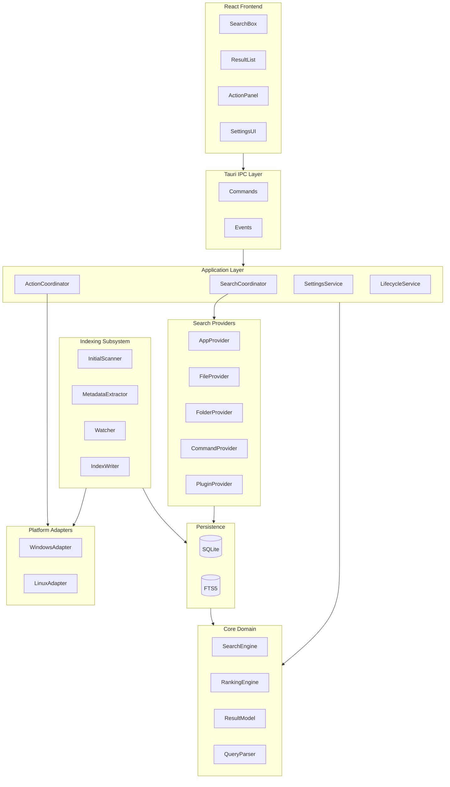

# System Architecture

## 1. Architectural Style

Use a layered, modular architecture with clear separation between:

1. UI
2. application orchestration
3. search domain
4. indexing domain
5. persistence
6. providers
7. platform adapters

The core rule is:

> The search engine should not know whether the application is running on Windows or Linux, and the React UI should not know how files are indexed.

## 2. High-Level Architecture



## 3. Frontend Layer

The frontend should be treated as a rendering and interaction layer.

Main components:

```text
App
├── LauncherWindow
│   ├── SearchInput
│   ├── ResultList
│   │   └── ResultRow
│   ├── ResultPreview       optional later
│   └── ActionBar
│
└── SettingsWindow
    ├── GeneralSettings
    ├── IndexingSettings
    ├── ShortcutSettings
    ├── AppearanceSettings
    └── PrivacySettings
```

The launcher window should be able to render before the backend returns any search result.

## 4. Tauri IPC Layer

Define a small, explicit command surface.

Example commands:

```text
search(query, context)
execute_action(result_id, action_id)
get_settings()
update_settings(changes)
get_index_status()
rebuild_index()
```

Backend-to-frontend events might include:

```text
index-progress
index-completed
index-error
settings-changed
provider-status-changed
```

Avoid dozens of tiny IPC calls during each keystroke. One search command should return a complete result list for that query generation.

## 5. Search Coordinator

The Search Coordinator orchestrates providers.

Pseudo-flow:

```text
query received
    ↓
assign query generation ID
    ↓
normalize query
    ↓
select enabled providers
    ↓
run fast local providers concurrently
    ↓
merge candidates
    ↓
rank
    ↓
truncate
    ↓
return results
```

A query generation ID prevents older asynchronous results from replacing newer results.

Example:

```text
Query #120: "git"
Query #121: "gith"

If #120 finishes after #121,
#120 must be ignored by the UI.
```

## 6. Provider Architecture

Providers convert a query into candidates.

Conceptually:

```rust
trait SearchProvider {
    fn id(&self) -> ProviderId;
    fn search(&self, query: &SearchQuery) -> Vec<SearchCandidate>;
}
```

Possible providers:

- ApplicationProvider
- FileProvider
- FolderProvider
- CommandProvider
- CalculatorProvider
- ClipboardProvider
- PluginProvider

Providers should not decide the final order. They produce candidates and useful scoring signals. The ranking engine decides final ordering.

## 7. Ranking Engine

The ranking engine should combine multiple signals.

Example model:

```text
final_score =
    match_score
  + exact_match_bonus
  + prefix_bonus
  + type_priority
  + frequency_weight
  + recency_weight
  + context_weight
  + user_pin_bonus
```

All weights should eventually be configurable internally so ranking can evolve without changing provider APIs.

## 8. Indexing Subsystem

Indexing runs separately from interactive search.

Components:

### Initial Scanner

Walk configured roots.

### Metadata Extractor

Extract:

- path
- name
- extension
- file type
- timestamps
- size
- hidden status

Later extractors can add document metadata.

### Watcher

Receives filesystem events and queues incremental changes.

### Index Writer

Batches writes into SQLite transactions.

Do not write one SQLite transaction per filesystem event when large bursts occur.

## 9. Background Task Model

Recommended task separation:

```text
UI thread/webview

Rust runtime
├── interactive search tasks
├── filesystem watcher
├── index update queue
├── low-priority scanner
├── usage telemetry recorder
└── maintenance task
```

Interactive search always receives higher priority than indexing maintenance.

## 10. Action System

A result may have multiple actions.

Example file result:

```text
Primary: Open
Secondary:
- Reveal in folder
- Copy path
- Open terminal here
- Open with...
```

The UI should not contain platform-specific action logic. It sends a generic action request to the backend.

## 11. Error Boundaries

Failures should be isolated.

Examples:

- failed plugin must not crash core search
- inaccessible folder must not stop scanning other folders
- malformed `.desktop` file must be skipped
- missing icon must fall back to a generic icon
- unavailable application should be removed or down-ranked

## 12. Logging

Use structured logging through Rust `tracing`.

Suggested categories:

```text
launcher
search
ranking
indexer
watcher
database
platform.windows
platform.linux
plugin
```

Production logs must not contain the content of personal files.
