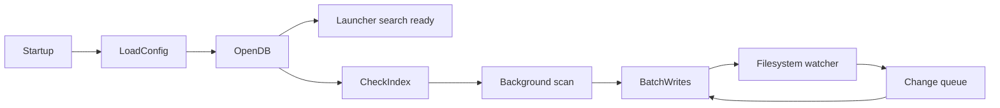
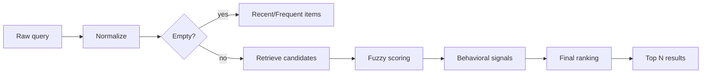

# Search and Indexing Design

## 1. Why Indexing Is Required

Walking the filesystem whenever the user types would be too slow and would produce unnecessary disk activity.

Instead:

```text
Filesystem
    ↓ background scan
Search Index
    ↓
Queries read the index
```

After the initial scan, filesystem watchers update only changed items.

## 2. Index Lifecycle



The launcher should become usable before a full re-index completes.

## 3. Indexed Data

For the MVP, index metadata rather than file contents.

Store:

- canonical path
- display name
- normalized name
- parent directory
- extension
- item type
- file size
- created/modified timestamps where available
- indexed timestamp
- provider/source
- hidden flag

For applications additionally store:

- application ID
- executable/launch target
- icon reference
- keywords/categories

## 4. Index Roots

Default indexing should be conservative.

Examples:

### Linux

- Home/Documents
- Home/Downloads
- Home/Desktop
- user-selected development/work directories

### Windows

- Documents
- Downloads
- Desktop
- optionally common project directories

Do not blindly index entire system disks by default.

## 5. Ignore Rules

Ignore expensive/noisy directories unless the user explicitly enables them.

Examples:

```text
.git
node_modules
target
build
dist
.next
.cache
__pycache__
.venv
vendor
Trash/Recycle Bin
system caches
```

Support:

- built-in defaults
- user global ignore patterns
- root-specific ignore patterns
- hidden file preference

The Rust `ignore` crate can help implement `.gitignore`-style semantics.

## 6. Initial Scan

Use a bounded worker pool.

Do not create an unbounded async task for every filesystem entry.

Suggested pipeline:

```text
Directory walker
    ↓
bounded channel
    ↓
metadata workers
    ↓
bounded channel
    ↓
batch database writer
```

This provides backpressure and predictable resource usage.

## 7. Incremental Updates

Filesystem events can be noisy and duplicated.

Raw watcher events should pass through:

```text
Raw events
    ↓
debounce
    ↓
coalesce
    ↓
normalize
    ↓
update queue
```

Example:

```text
create temp file
write temp file
rename temp file
modify final file
```

may represent one logical editor save.

## 8. Search Pipeline



## 9. Query Normalization

Normalize carefully:

- trim whitespace
- case folding
- Unicode normalization
- collapse repeated spaces
- preserve meaningful punctuation in paths

Do not destroy information required for exact path search.

## 10. Candidate Retrieval

Retrieve more candidates than the UI displays.

Example:

```text
SQLite/FTS candidates: 100
        ↓
Rust ranking
        ↓
UI results: 10-20
```

This gives the ranking engine enough choices while keeping rendering cheap.

## 11. Match Scoring

Useful match signals:

### Exact name

`chrome` → `Chrome`

Very high score.

### Prefix

`vis` → `Visual Studio Code`

High score.

### Word prefix

`studio` → `Visual Studio Code`

High score.

### Subsequence/fuzzy

`vsc` → `Visual Studio Code`

Moderate-to-high score.

### Path match

`project api` → `/home/user/projects/api`

Useful but typically below a filename match unless path-oriented intent is detected.

## 12. Usage Ranking

Record successful actions.

Suggested history fields:

```text
item_id
last_used_at
use_count
query_used
selected_position
```

Then compute a behavioral boost.

Recency should decay over time rather than remain permanent.

## 13. Example Ranking Formula

A simple first version:

```text
score =
    0.55 * textual_match
  + 0.15 * exact_or_prefix_signal
  + 0.10 * type_priority
  + 0.10 * frequency_score
  + 0.10 * recency_score
```

Do not overfit these numbers initially. Add telemetry/debug tooling that can explain why a result was ranked.

## 14. Search Debouncing

Use minimal frontend debouncing, typically around 20-50 ms if needed.

Do not use large web-style debounce intervals such as 300-500 ms because they make the launcher feel sluggish.

Cancellation/generation handling is more important than large debouncing.

## 15. Empty Query Behavior

When the search field is empty, show useful default items:

- recently used apps
- frequently used apps
- pinned items
- recent files if enabled

This makes the launcher useful before typing.

## 16. Future Content Search

Content indexing can be added later as a separate subsystem.

Potential formats:

- text
- markdown
- source code
- PDF
- Office documents

This should use separate tables/indexes so filename search remains fast.

## 17. Future Semantic Search

Do not start with embeddings.

Semantic search introduces:

- model dependencies
- more storage
- content privacy concerns
- index complexity
- slower updates

Add it only after conventional search quality and UX are excellent.
